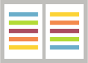

  

<h1 align="center">كتب عربية حرة | Libre Books</h1>

<a href="https://librebooks.org">LibreBooks.org</a>

مشروع يهدف إلى تشجيع وتعزيز المحتوى العربي ودعم المبادرات مثل الوصول إلى المعرفة، الوصول المفتوح، ورخص المشاع الإبداعي.

A project aims to encourage and enhance Arabic content and support initiatives like Access to Knowledge, Open Access, and Creative Commons.
